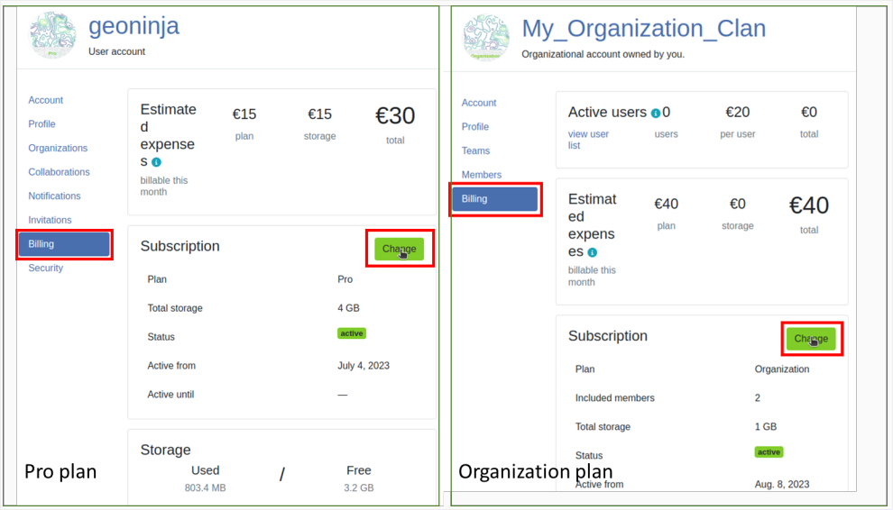
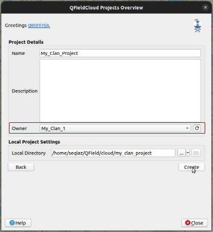
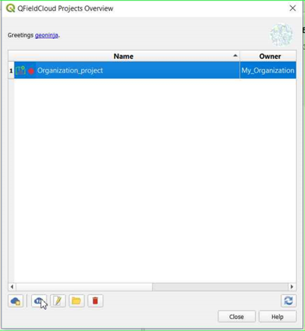
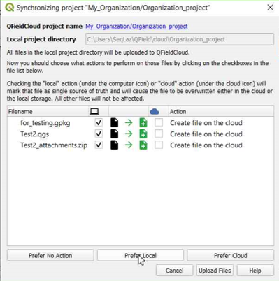
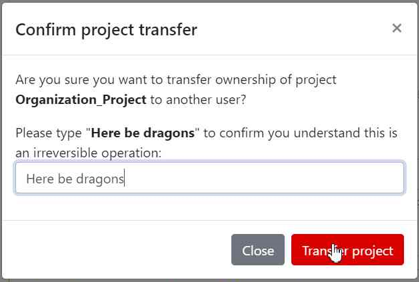
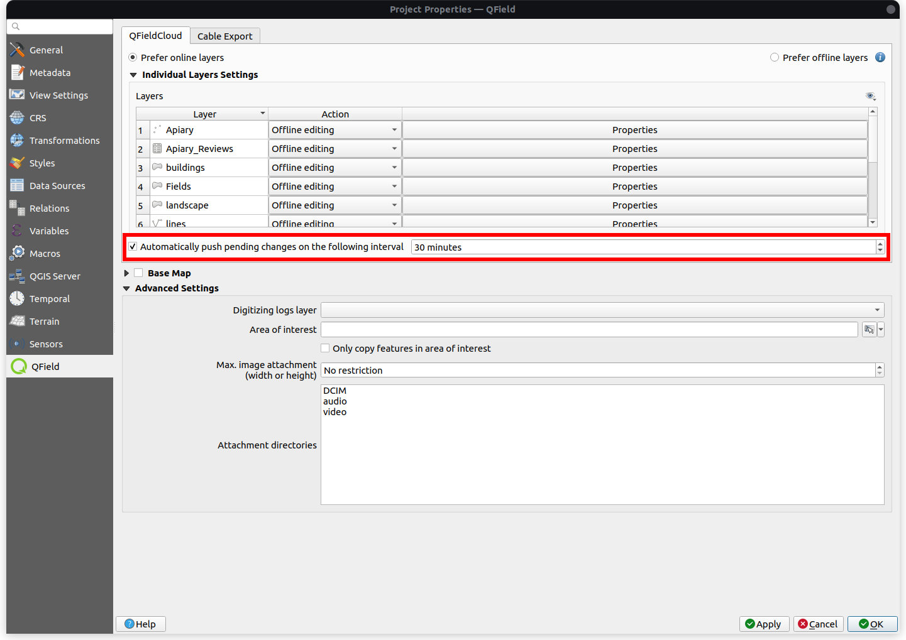

# Getting started guide

!!! help
    We have a [community discussion platform](https://github.com/opengisch/qfield/discussions) to discuss your questions, doubts and ideas. Do not hesitate to check it out.

## Get a QFieldCloud account

:material-monitor: Desktop preparation

Go to the [registration page](https://app.qfield.cloud/accounts/signup/), enter your details and create a new QFieldCloud account.

!

### Edit Profile

Change your personal settings. Add a profile picture or get an overview about your ownerships and memberships in organizations.

### Billing

Adding billing information to the account is needed to use QFieldCloud Pro plan or Organization plan.

For a **Pro plan**, follow these steps :

1. Click on the username up-right the page
2. Click on "Upgrade to pro"
3. In the "Subscription" section, click on "Upgrade"
4. In Pro section, click on "Activate"
5. Carefully read the "Terms of Service" and agree to the terms of service, then "Proceed"
6. In the "Billing Address" section, fill up the form, and then click on "Proceed to payment"

For an **Organization plan**, follow these steps :

1. Click on the username up-right the page
2. Click on "Create organization"
3. Click on "Create"
4. Choose a name for your organization with only 150 characters or fewer, letters, digits, and @/./+/-/_
5. Click on "Create"
6. Choose how much storage is needed
7. Carefully read the "Terms of Service"and agree to the terms of service, then "Proceed"
8. In the "Billing Address" section, fill up the form, and then click on "Proceed to payment"

If the billing information is incomplete, at any time it is possible to finish filling up the form by going to *Billing > Subscription > Finish checkout*

All pricing information is available <a href="https://qfield.cloud/pricing" target="_blank">on the Pricing page</a>.

### Discontinuing Services in QFieldCloud

1. If you need to cancel your subscription on QFieldCloud:
1.1. For **Pro** plan accounts, click on your username, choose "Settings."
1.2. For **Organization** plan account, click on the name of your Organization, click on "Edit Organization". Note you need to be owner of that Organization.

    

2. Proceed to the "Billing" section, click on "Change".

    

3. Select "Cancel Subscription".

    

4. Confirm the cancellation in the subsequent pop-up window.

    

5. A Nyuki message will then appear, indicating that the subscription will conclude at the end of the current billing period.

    

### Organizations

Your organizations are listed here. Find out more about teams, members and their roles in [concepts of the QField Ecosystem](https://docs.qfield.org/reference/qfieldcloud/concepts/).

### Projects

Search and choose a project from the list or start to create a new project.

!

## Connection to QFieldCloud on QGIS Desktop

:material-monitor: Desktop preparation

In order to connect to QFieldCloud, you need the Plugin “QFieldSync” in QGIS. The next steps show you how you can install and synchronize your data to and from QFieldCloud.

### Install QFieldSync

Open the QGIS plugin manager by going to the `Plugins -> Manage and install Plugins…` menu.

Find QFieldSync in the list of plugins and install the latest version by clicking the `Install Plugin` button.

!!! note
    Since QFieldCloud is still in beta phase, there are frequent updates and fixes. Please upgrade your QFieldSync plugin often. In case of an issue, please try upgrading to the latest release before reporting.

!

After successful installation, a new toolbar appears:

### Login to QFieldCloud

Click the cloud icon {Width="20px"} in the QFieldSync toolbar.
A new login screen will appear:

!

Enter your credentials previously created during account registration.

!!! Note
    If you use a password in QGIS for the first time, it will ask you to set a master password that manages all the other passwords used in QGIS. More information about the master password here: [QGIS documentation](https://docs.qgis.org/3.4/en/docs/user_manual/auth_system/auth_overview.html#master-password)

Explore the projects overview screen: your current user underlined and blue, a logout button down-left, a cloud button to create a new project and, on the right, a refresh button to grab the freshest project list. Newly registered users will see an empty table and as soon as they create new projects, the list will grow. The projects overview screen looks like this:

!

The icons indicate the cloud and local status of the different projects.

Local status:

{Width="20px"} indicates that there is only a remote cloud project existing.
{Width="20px"} indicates that the cloud project is also locally stored.

Cloud status:

Red: status failed —> the project is invalid and is not understood by the cloud. The user needs to fix/upload their .qgs/.qgz project.
Brown: status busy —> we are working on your project, please be patient. You cannot do much with the project in the meanwhile.
Green: status ok —> the project is successfully undestood by the cloud. You can try to download on QField, but the success is not guaranteed.

The status of each project is shown with a tooltip.

By double-clicking on a project in the list, you can see and edit the specific project properties.

!

### Change the default QFieldCloud server in QField and QField Sync

QField and QFieldSync connect to the QFieldCloud service on [app.qfield.cloud](https://app.qfield.cloud/) by default.

You can modify the default QFieldCloud server QField and QFieldSync connect to:

1. Open the login screen in QField or QFieldSync.
2. Double-tap on the Nyuki icon (the blue bee QFieldCloud logo).
3. This action will reveal a field where you can enter the preferred QFieldCloud server address.
4. Enter the details of the desired server in the provided field.
(Leaving the field empty will connect to the default QFieldCloud server at app.qfield.cloud.)

!

!

!!! Note
    It's important to note that QFieldSync does not support the same cloud project in multiple QGIS profiles. As a recommendation use a single QGIS profile for your QFieldCloud projects to avoid synchronization issues.

### Create and configure your Cloud project

Create a new project by clicking the cloud button, down-left. First, you will need to choose how to create the new project between

* "Convert currently open project to cloud project"
  A new QFieldCloud-compatible project is created from the currently opened QGIS project. In order to do so, datasets will be copied into an export directory that will act as your local mirror. Vector datasets will be converted to geopackage format to facilitate data synchronization from multiple devices while other dataset types will be copied to the new project lotation.

To convert a current project, a completely empty directory is mandatory.

* "Create a new empty QFieldCloud project"
  A new blank QFieldCloud project will be created. You will be responsible to move all the project-related files within the selected local directory, with the project file at its root. Project files will only be uploaded when you click the synchronize button. Make sure the selected contains no more than one QGIS project file.

!

A form will ask you for project name, description and local directory. In the local directory you can get different situations:

* The entered path does not contain a QGIS project file yet.
* The entered path contains one QGIS project file.
* Please select local directory where the project to be stored.
* The entered path is a relative path. Please enter an absolute directory path.
* The entered path is not an directory. Please enter a valid directory path.
* The entered path is not an existing directory. It will be created after you submit this form.
* Multiple project files have been found in the directory. Please leave exactly one QGIS project in the root directory.

### Create a project in an Organization

How to create a project in an organization:

**Option 1: Directly convert your local project to an Organization QFieldCloud project:**

1. Follow the steps [configure your cloud project](#create-and-configure-your-cloud-project), ultil you get the "Project details".

2. Change the owner of the project to your Organization.

    

3. Click on "Create" to start the conversion and synchronization. When finish you will see the project is in your Organization in QFieldCloud.

    

!!! note
    QField Sync 4.6 or newer is required for this functionality

**Option 2: Uploading directly to the organization:**

1. Select your organization.

    

2. Once you get into the organization, click on "Create a project".

    

3. Select "Create a new empty project".

    

4. You can see the new project in the overview.

    

5. On QGIS in QFieldSync, you will see the new project listed, click on "Edit Selected Cloud Project".

    

6. Choose the folder where you want to save the project.

    

7. In the selected folder, you can either paste an already worked-on project or save a new one.

    

8. Once the folder contains the project, you can synchronize it.

    

9. Finally, push the changes to the cloud.

    

10. You can verify that the files are present in the Organization project.

    

**Option 3: Moving the project from your own account to the Organizations:**

1. If you already have a project in QFieldCloud (refer to [configure your cloud project](#create-and-configure-your-cloud-project)). In the project, click on "Settings" and select "Transfer ownership of this project" to choose the desired Organization for the transfer.

    

2. A pop-up window will appear to confirm the transfer. To proceed, you will need to type "Here be dragons" and click "Transfer project".

    

### Configure your project layers for QField

Configure the project layers by clicking the fifth icon in the QFieldSync toolbar {Width="20px"}. Here you can configure QFieldCloud layer actions. Most of the time you need to configure a preference either to online or offline layers. For more fine grained control, in the advanced settings you can configure the action layer by layer. Get more information about how to configure your layers in the [Get Started guide for QFieldSync](./get-started-qfs.md)!.

It is recommended to use GeoPackage layers for collaborative editing. See the [advanced setup guide](advanced-setup-qfc.md) for more information about vector formats support.

!!! note
    If you use experimental data sources without a primary key field (e.g. Shapefiles, GeoJSON etc), you must have a lowercase `fid` field that will be used as a primary key that uniquely identifies each feature.

Any QField supported raster and vector layer formats may be used as read-only data.

!

### Enabling Automatic Pushing of Changes to QFieldCloud

With this functionality, users and managers of QFieldCloud projects can enforce automatic pushing of pending changes to QField devices in the field, as well as specify the interval in between automated pushes. The functionality is activated through a project setting, allowing remote activation.

1. **Access Project Settings**: Navigate to the QField panel in the Project Settings dialog provided by the QFieldSync plugin.

2. **Enable Auto-Push**: Toggle the "Automatically push pending changes on the following interval" option and establish your preferred interval.

!

!

!!! Note
    #### Benefits:

    - **Real-Time Updates**: Ensures prompt synchronization of field data with the QFieldCloud project.
    - **Streamlined Workflow**: Minimizes manual intervention and ensures surveyors do not need to worry about synchronization, helping them focus on data quality.

    #### Considerations:

    - **Network Stability**: Ensure stable internet connectivity for auto-push functionality.
    - **Battery Optimization**: Implement strategies to mitigate battery consumption on QField devices during prolonged fieldwork.

### Upload a project

Once configured, you can press the cloud button to open the synchronization dialog. Here you have to decide what do you prefer: the local file or the file on the cloud.

!

Now you should see your project and files on [QFieldCloud](https://app.qfield.cloud/)

### Activate Notifications for QFieldCloud changes

1. Access the Settings of your account.
2. Navigate to the Notifications section. Here, you can customize the frequency of notifications you wish to receive at the email address registered with your account.

    The events you get notified about are:
    - User created
    - Organization created
    - Organization deleted
    - Organization membership created
    - Organization membership deleted
    - Team created
    - Team deleted
    - Team membership created
    - Team membership deleted
    - Project created
    - Project deleted
    - Project membership created
    - Project membership deleted

You will receive notifications for events in which you are not the actor. These notifications are specifically for events that are initiated by other members of your organization or collaborators on your projects.

## Enhance your project with the "Optimized Packager"

We recommend to use the new "Optimized Packager" over the deprecated "QGIS Core Offline Editing" for all your projects. Set the packager under "Packaging Offliner" in the "Settings" tab of your project.

The "Optimized Packager" supports consolidating filtered layers of same datasource into a single oflline layer, respecting distinct symbology but also using less storage. Here is an example to illustrate this feature:

### Example Configuration:

- **Layer 1.1:**
  - Data Source: `layers.gpkg`
  - Table: `layer1`
  - Filter: `id % 2 = 1`

- **Layer 1.2:**
  - Data Source: `layers.gpkg`
  - Table: `layer1`
  - Filter: `id % 2 = 0`

### Result:

For the new offliner:
- A single layer is generated in the offline geopackage, combining data from `layer1` with the specified filters.

For the old (QGIS) offliner:
- Two separate layers are created, each representing the filtered datasets:
  - Layer 1: Filtered with `id % 2 = 1`
  - Layer 2: Filtered with `id % 2 = 0`

!

## Field device

:material-tablet: Fieldwork

### Install QField

Download and install the latest version of [QField from the play store](https://play.google.com/store/apps/details?id=ch.opengis.qfield_dev). Scroll to the bottom and enable beta testing.
Do not use this version in production!

!!! note
    Since QField 2.0 is still in beta phase, there are regular updates and fixes at least on a weekly basis. Please upgrade your experimental QField at least once a week. In case of an issue, please try to reproduce on the latest release before reporting.

### Start working on your project

!

Login with your username and password

!

Select a project to download on your device:

!

### Synchronise your changes

Make a change to your project. Either create a new feature, delete a feature, or modify the geometry or attributes.
Open the blue cloud button on the top left of the screen:

!

Choose an action with the change you made to your project. Each of the actions have an explanation what you should expect to happen:

!

Your changes are now available to everyone who has access to your project on the cloud.

You can find more information on [Advanced QFieldCloud setup](./advanced-setup-qfc.md) and [QFieldCloud technical reference](../../reference/qfieldcloud/concepts.md).
