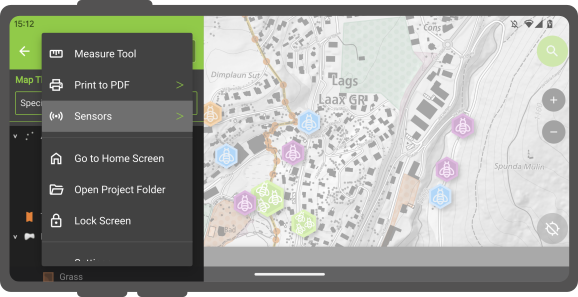
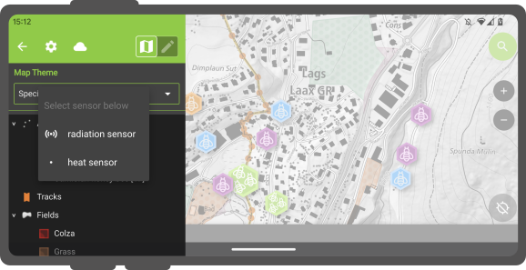
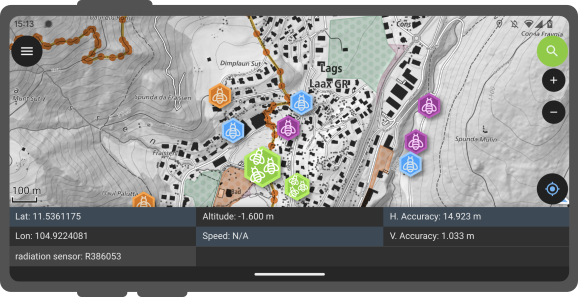
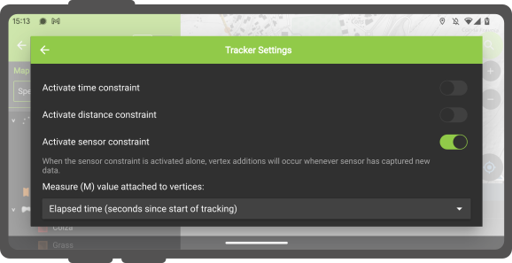

# Sensors

QField offers a range of sensor functionalities that allow you to passively collect sensor data in the background,
display the collected data, and save it into newly-digitized feature attributes.

## Activating sensors

In QField, registered sensors are listed within the currently opened project file in a sub-menu thatcan be
accessed via the side dashboard's main menu.

!

To toggle the passive collection of sensor data, simply click on a sensor name in the sub-menu. When active,
a sensor icon will appear next to the sensor name, while when inactive, a dot icon will be shown.

!

All active sensors that are collecting data will be listed in a sensors information table located at the bottom
of QField's map canvas.

!

## Sensor-Driven Tracking

QField enables you to initiate tracking sessions against a point layer, saving collected sensor data linked to
your current position. To do this, you'll need to prepare the attribute default value for the point layer in QGIS by
using the default value sensor_data('abc'), where 'abc' is replaced with the name of the sensor registered in the
project file. Visit the attributes form documentation page to learn more about default values.

Once this configuration is done, you can start tracking your position against the point layer. When starting the
tracking session, a sensor constraint can be activated to ensure that added points occur every time a sensor has
captured new data.

!
